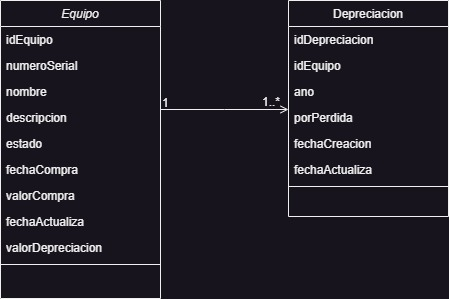
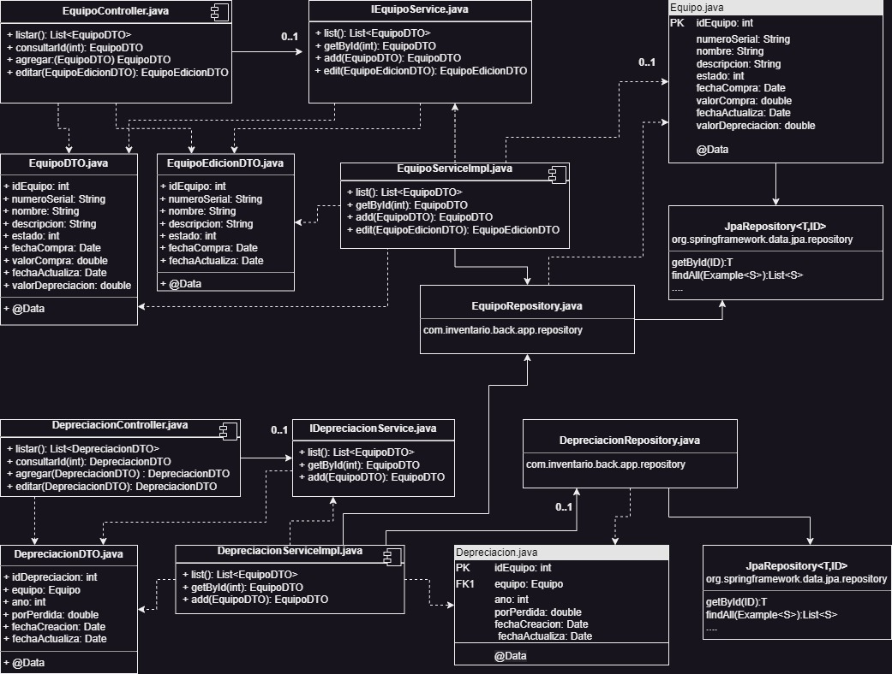
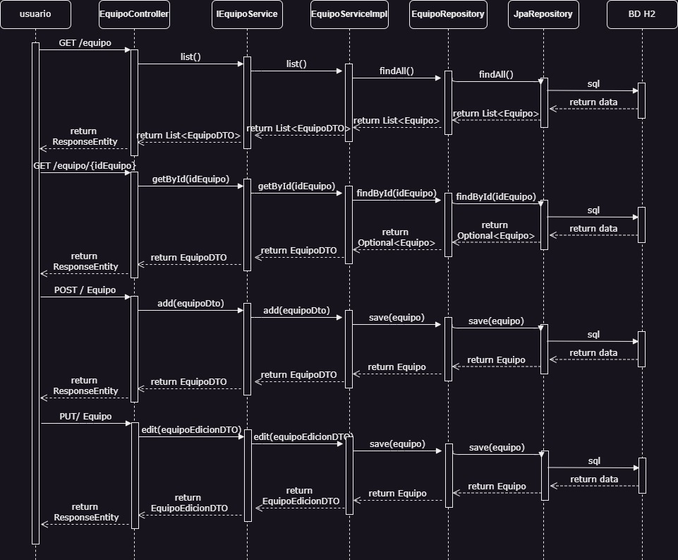
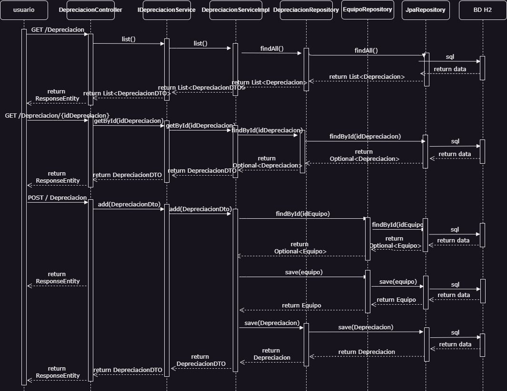

## Inventario Back

Este proyecto permite gestionar el inventario y depreciacion de los activos de una compañia

## Tabla de Contenidos

- [Tecnologias](#tecnologias)
- [Instalacion y Ejecucion](#instalacion-y-ejecucion)
- [Base De Datos](#base-de-datos)
- [Pruebas Unitarias](#pruebas-unitarias)
- [Diagramas](#diagramas)

##Tecnologias

Tecnologias utilizadas en el proyecto:

 - [JDK]: Version 19.0.2
 - [maven]: Version 4.0.0
 - [mapstruct]: 1.5.3.Final
 - [Spring Boot]: 3.1.1
 - [lombok]: 1.18.28
 - [Swagger UI]: Version 2.1.0
 - [junit]: Version 5.9.1
 - [H2]
 - [JPA]
 
 
##Instalacion y Ejecucion
 
 Estos son los pasos a seguir para la instalacion y ejecucion del proyecto (esta aplicacion solo se puede desplegar de forma local):
 
 - git clone https://github.com/GustavoPSA/inventario-back.git
 - Abrir el entorno de desarrollo integrado (IDE) preferido, como Spring Tool Suite (STS) u otro IDE compatible con proyectos de Spring.
 - Importar el proyecto clonado en si IDE. En STS, puede hacerlo seleccionando "File" (Archivo) -> "Import" (Importar) -> "Existing Maven Projects" (Proyectos Maven existentes) y luego        	navegando hasta la carpeta raíz del proyecto clonado.
 - Esperar a que el IDE importe y construya el proyecto. Pueden pasar algunos momentos mientras se descargan las dependencias de Maven y se configura el proyecto.
 - Una vez que el proyecto se haya importado correctamente, hacer clic derecho en el proyecto y selecciona "Run as" (Ejecutar) o "Debug" (Depurar) para ejecutar la aplicación Spring.
 - Para probar la aplicacion se realiza ingresando a la siguiente URL: http://localhost:8080/inventario-back/swagger-ui.html
 
##Base De Datos

Esta aplicacion, cuenta con una base de datos H2, la cual tiene la sisguientes tablas:

 - Equipo: En esta tabla se almacena la informacion de los equipos del inventario, importante tener en cuenta que en la edicion, no se permite modificar los campos Valor Compra y Valor depreciacion
 - Depreciacion: En esta tablka se almacena el porcentaje de depreciacion por cada equipo correspondiente a cada año, es importante tener en cuenta que a traves de la aplicacion solo s epodra realizar registro y consulta de informacion en esta tabla
 
##Pruebas Unitarias

- El proyceto cuenta con pruebas unitarias, las cuales se pueden encontrar en la ruta src/test/java. Para ejecutarlas se debe hacer clik derecho en el proyecto -> Run AS -> JUnit Test
 
##Diagramas

- Diagrama de Clases:

- Diagrama de Componentes

	
- Diagrama de Secuencia Equipo

	
- Diagrama de Secuencia Depreciacion

	
	
 